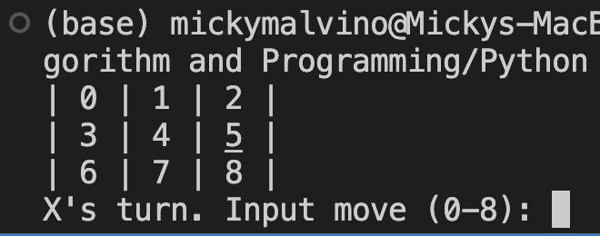

# Algorith and Programming Final Project
## Tic Tac Toe
Contains game.py and player.py

To play, press play button on game.py in vsc and press key 0-8 to start, 
each key will determine the position on the 3x3 grid

3 modes: 1v1⚔, player vs.robot🤖, and impossible mode🤬 (by default it is set to player vs. robot)

Micky Malvino Kusandiwinata 

2602174522

class L1CC

  

  
  

